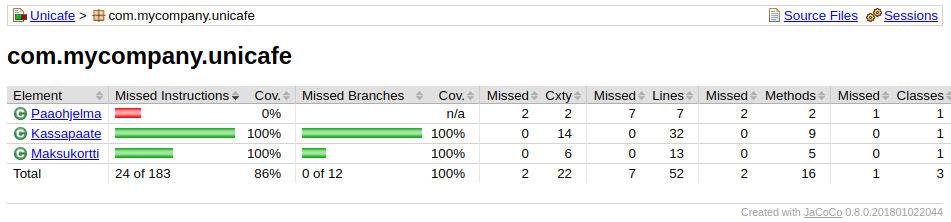

# ot-harjoitustyö - otlike

## Mikä?
Kurssin *"Ohjelmistotekniikka"* harjoitustyönä tuotettu yksinkertainen roguelite-henkinen luolaseikkailu, jossa lätkitään mörköjä turpaan ja otetaan turpaan kahta kovemmin.

## Dokumentaatio
- [tuntikirjanpito](documentation/tuntikirjanpito.md)
- [vaatimusmäärittely](documentation/vaatimusmäärittely.md)

## Laskarit - viikko 1
- [komentorivi.txt](laskarit/viikko1/komentorivi.txt)
- [gitlog.txt](laskarit/viikko1/gitlog.txt)

## Laskarit - viikko 2

- [viikko 2](laskarit/viikko2/)
