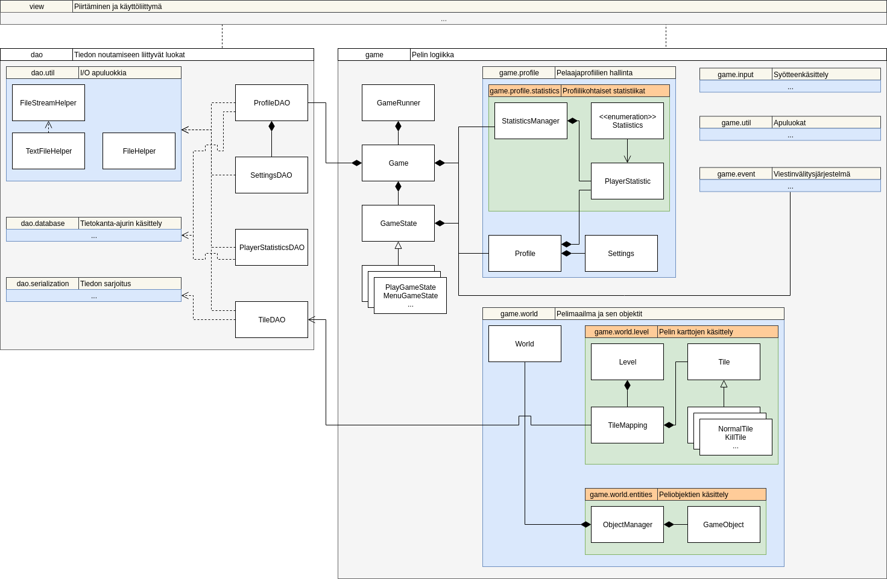
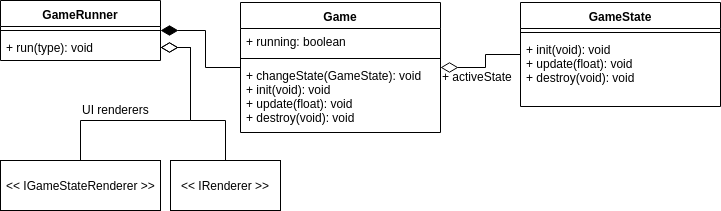
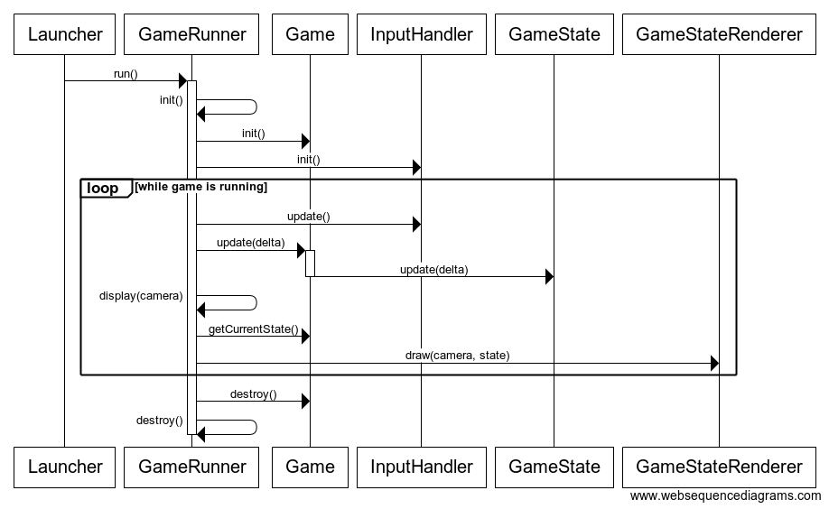

# Arkkitehtuurikuvaus

## Rakenne

Aloitetaan nostamalla kissa pöydälle, eli yllä siis pelin luokkarakenne kuvattuna luokkakaaviona, yksinkertaisella tasolla siten että esim. peliobjektin aliluokat eivät ole listattuna (Peliobjektin aliluokissa on valtaosa pelilogiikasta mutta siitä lisää myöhemmin).

Koodi on jaoteltu pakkausrakenteessa kokonaisuuksiin `game`, `dao` ja `view`, joista kukin vastaa selkeästi erillisestä osa-alueestaan. Pakkaus `view` sisältää käyttöliittymään ja pelin visuaaliseen osa-alueeseen liittyvät luokat, `dao` tiedon tallentamiseen/lukemiseen tarvittavat luokat ja `game` sisältää sovelluslogiikan. Pakkauksen `view` alla on vielä pakkaus `lwjgl` joka sisältää varsinaisen konkreettisen käyttöliittymätoteutuksen, toteutettuna käyttäen [LWJGL3-kirjastoa](https://www.lwjgl.org/).

## Sovelluslogiikka

Sovelluslogiikka ajaa pelin simulaatiota [`GameRunner`](../src/main/java/toilari/otlite/game/AbstractGameRunner.java)-luokan avulla. `GameRunner` vastaa sovelluslogiikan ja käyttöliittymän ajamisesta. Tämä saavutetaan kutsumalla luokan [`Game`](../src/main/java/toilari/otlite/game/Game.java) (ja käyttöliittymälle spesifien luokkien) metodeja. Nykyisessä käyttöliittymätoteutuksessa `GameRunner` kutsuu pääloopissa päivitysrutiinien jälkeen [`IRenderer`](../src/main/java/toilari/otlite/view/renderer/IRenderer.java)-rajapinnan toteutuksien tarjoamia metodeja käyttöliittymän näyttämiseksi.

Päälaelleen käännettynä siis pelimoottorin korkean tason toiminta on seuraava:
- `Game` sisältää sovelluslogiikan
- `GameRunner` käärii luokan `Game` ja ajaa sen metodeilla sovelluslogiikkaa tarjoamassaan pääloopissa, kutsuen käyttöliittymälle tarvittavia metodeja.
- `GameRunner` myös (toteutuksesta riippuen) välittää sovelluslogiikalta saatua pelin tilaa käyttöliittymälle.
- Ainoa yhteinen osa koodissa joka viittaa sekä sovelluslogiikkaan että käyttöliittymään on luokan `GameRunner` toteutuksessa.

### Game
Tarkemmin tarkasteltuna `Game` ei itse sisällä juuri lainkaan sovelluslogiikkaa. Pääloopin pitämiseksi siistinä, `Game` toimii vain eräänlaisena *State-ratkaisumalliin* perustuvana tilakoneena, jonka tarjoama varsinainen toiminnallisuus tulee abstraktin luokan [`GameState`](../src/main/java/toilari/otlite/game/GameState.java) konkreettisilta toteutuksilta.

Itsessään `Game` tarjoaa vain metodit tilakoneen tilan vaihtamiseen ja hakemiseen, sekä nykyisen tilan päivittämiseen. `Game` ottaa konstruktorissa oletustilan, joka asetetaan aktiiviseksi pelin suorituksen alkaessa (`GameRunner.run()`-metodi).

Pelitilan vaihdon yhteydessä, mikäli pelillä on aikaisempi tila, sen resurssit tuhotaan ja uusi pelitila vastaavasti alustetaan.

### GameState
Varsinainen sovelluslogiikka on luokasta `GameState` perivissä konkreettisissa toteutuksissa. Esim. [`PlayGameState`](../src/main/java/toilari/otlite/game/PlayGameState.java) tarjoaa itse pelin toiminnallisuuden.

Pelissä on tällä hetkellä neljä eri tilaa:
- `SelectProfileGameState` eli profiilinvalinta
- `MenuGameState` eli päävalikko
- `BestiaryGameState` eli "bestiary" (eli ruutu jossa pääsee tarkastelemaan tilastoja ja erilaisten hahmojen tietoja)
- `PlayGameState` eli itse peli

Kullakin pelitilalla on oma [viestinvälitysjärjestelmä](../src/main/java/toilari/otlite/game/event/EventSystem.java)-instanssi, jonka kautta käyttöliittymä ja/tai pelioliot voivat lähettää ja vastaanottaa viestejä ilman että niiden tarvitsee tietää kuka viestejä vastaanottaa. Tällä mahdollistetaan sovelluslogiikan ja käyttöliittymän vuorovaikutus ilman että käyttöliittymä tai sovelluslogiikka olisivat riippuvaisia toisistaan.

## Korkeamman tason pelilogiikka

Pelissä on maailma jossa on yksi aktiivinen ruutupohjainen kartta ja useita peliobjekteja. Peliobjekteja hallinnoi erillinen luokka [`ObjectManager`](../src/main/java/toilari/otlite/game/world/entities/ObjectManager.java) ja kartasta vastaa [`Level`](../src/main/java/toilari/otlite/game/world/level/Level.java). Asioiden yksinkertaistamiseksi pelimaailmasta vastaava luokka [`World`](../src/main/java/toilari/otlite/game/world/World.java) käärii molemmat edellämainituista ja tarjoaa delegoidut metodit osalle näiden usein tarvituista toiminnoista.

### Pelihahmot

Pelihahmot ovat peliobjektien erikoistapaus, joille on lisätty erinäisiä hahmoille tyypillisen toiminnan toteuttamista helpottavia ominaisuuksia. Hahmojen toiminnallisuus on eriytetty rajapinnan `IAbility` toteuttaviin _"kykyihin"_ ja niitä ohjaaviin rajapinnan `IControllerComponent` toteuttaviin _ohjainkomponentteihin_.

Kykyjen lisäksi hahmoilla on erilaisia _attribuutteja_, jotka vaikuttavat hahmon eri kykyihin ja muuhun suorituskykyyn. Attribuuttien hallinnointi on toteutettu luokissa `CharacterAttributes` ja `CharacterLevels`. `CharacterLevels` vastaa _pääatribuuttien_ tasoista ja hahmon kokemustason hallinnasta ja `CharacterAttributes` sisältää attribuuttien arvot.

### Kartat

Kartat ovat yksinkertaisia ruudukkoja jotka rakentuvat erilaisista luokan `Tile` ilmentymistä. Karttat tallennetaan taulukkona koḱonaislukuja, joista jokainen vastaa jotain ruututyyppiä. Nämä vastaavuudet määritellään luokan `TileMapping` avulla.

## Käyttöliittymä
Korkeimmalla tasolla käyttöliittymästä vastaa `GameRunner`, joka suorittaa nykyistä pelitilaa vastaavan `IGameStateRenderer`-luokan ilmentymien tarjoamia metodeja. Käytettävät piirtäjien toteutukset injektoidaan konstruktorikutsun yhteydessä, jolloin käyttöliittymä on käytännössä täysin eriytetty sovelluslogiikasta.

Kullakin pelitilalla on oma piirtäjänsä ja `GameRunner` vastaa oikean piirtäjän valinnasta kullekin pelitilalle.

## Tiedon tallennus
Sovellus käyttää tietoa levyltä nykyisestä suorituspolusta hakemistoista `content/` ja `data/`. Hakemiston `content/` tulee olla olemassa entuudestaan, sillä se sisältää pelin sisällön luomisen/visualisoinnin kannalta elintärkeitä tiedostoja. Hakemisto `data/` sen sijaan luodaan ensimmäisellä käynnistyskerralla ja pelin asetustiedostot sekä profiilitietokanta tallennetaan sinne.

Tiedon hakeminen ja tallentaminen tapahtuu *Data Access Object*-suunnittelumallia mukailevien DAO-luokkien avulla, jotka abstraktoivat varsinaisen I/O:n helppokäyttöisempien metodien taakse.
