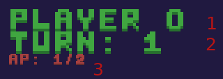
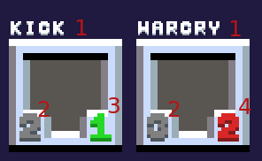

# Käyttöohje

## Pelaajaprofiilin valinta
Sovellus käynnistyy ruutuun jossa käyttäjä voi valita haluamansa pelaajaprofiilin. Ensimmäisellä käynnistykerralla profiileja ei vielä ole vaan sellainen tulee luoda painamalla _"Add"_. Luodut profiilit näkyvät alla listana ja kunkin profiilin voi poistaa sen vieressä olevalla punaisella painikkeella. Pelaajaprofiili valitaan painamalla halutun profiilin painiketta.

## Päävalikko
Päävalikossa on painikkeet pelin eri osiin siirtymiseen. _"Quit Game"_ poistuu pelistä ja sulkee sovelluksen, _"Bestiary"_ avaa _bestiaarin_ ("eläinkirja") jossa voi tarkistella kaikkien pelin hahmojen tietoja ja pelaajan tilastoja. Painike _"New Game"_ aloittaa uuden pelin.

## Peli

Pelin tavoitteena on pysyä hengissä mahdollisimman pitkään, samalla lyöden mahdollisimman suuri määrä luolassa majailevia enemmän ja vähemmän vihamielisiä otuksia.

Pelin aikana käyttöliittymässä eli _HUD_:ssa (_Head-Up Display_) näkyvät vasemmassa yläkulmassa pelin yleiset tiedot ja vasemmassa alakulmassa/alareunassa pelaajan käytettävissä olevat hahmon kyvyt. Hahmojen terveyspisteitä voi tarkastella viemällä hiiren jonkin hahmon päälle, jolloin sen terveyspisteet ilmestyvät näkyviin.

1. Pelaajan nimi
2. Monesko pelattava vuoro on menossa
3. Käytettävissä olevat toimintopisteet/lisäohjeet

1. Kyvyn nimi
2. Kyvyn numero (kertoo millä numeronäppäimellä kykyä käytetään)
3. Kyvyn hinta silloin kun käytettävissä on riittävästi toimintopisteitä
4. Kyvyn hinta silloin kun käytettävissä ei ole riittävästi toimintopisteitä

Pelihahmoa liikutetaan nuolista ja kykyjä aktivoidaan numeronäppäimistä. Välilyönti toimii yleisnäppäimenä jolla vahvistetaan kyvyn aktivointi tai lopetetaan vuoro.
    
Kyvyn aktivoinnin jälkeen valitaan kohde johon vaikutus halutaan kohdistaa. Nykyinen valittu kohde erottuu edestakaisin liikkuvasta nuoli-ikonista sen yläpuolella. Kohdetta voi vaihtaa joko painamalla kyvyn aktivointinäppäintä uudelleen, jolloin siirrytään automaattisesti myötäpäivään seuraavaan kohteeeseen tai valitsemalla suunta nuolinäppäimillä.

Kun haluttu kohde on valittu voidaan toiminto vahvistaa välilyönnistä tai peruuttaa painamalla esc. Kyvyn käyttämisen jälkeen kyky menee jäähtymään jolloin sen ikonin tilalla näkyy luku joka kertoo montako vuoroa kyky on vielä jäähtymässä.

## Kyvyt
Aktivoitavia kykyjä on tällä hetkellä kolme:

#### Normaali hyökkäys
Normaali hyökkäys eli "basic attack" tekee pelihahmon attribuuttien määrittämän vahinkopisteiden määrän mukaan vahinkoa hahmon vieressä olevaan kohteeseen.

#### Potku
Potku tekee normaalin hyökkäyksen määrän vahinkoa, mutta tönäisee myös kohdehahmoa poispäin pelaajasta. Tämä on hyödyllistä mm. pelaajaan kohdistuvien hyökkäyksien välttämiseen ja _valitettavien onnettomuuksien_ aiheuttamiseen. Tehdyn vahingon määrä kaksinkertaistuu mikäli hahmoa ei voida lainkaan siirtää poispäin sen takana olevan seinän vuoksi.

#### Sotahuuto
Sotahuuto (_"warcry"_) kylvää kauhua lähellä oleviin hahmoihin ja voi pelaajan attribuuteista riippuvalla todennäköisyydellä saattaa ne paniikkiin. Panikoivilla hahmoilla on 30% todennäköisyys joka vuoron lopuksi lopettaa panikointi. Panikoivat hahmot eivät kykene hyökkäämään, vaan liikkuvat vain pakonomaisesti poispäin kohteesta joka alunperin aiheutti paniikin.